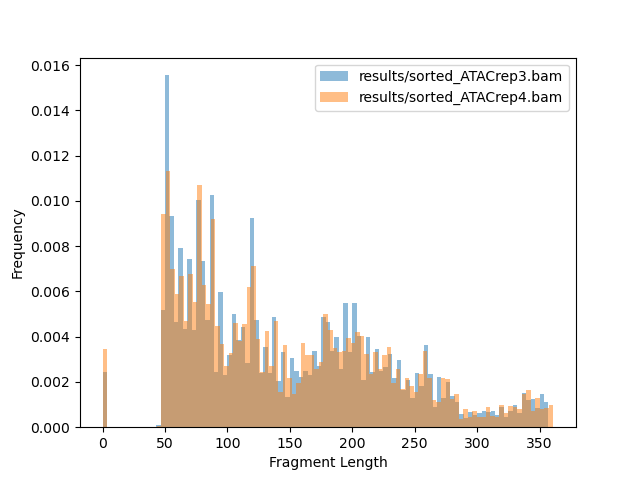
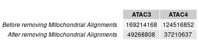
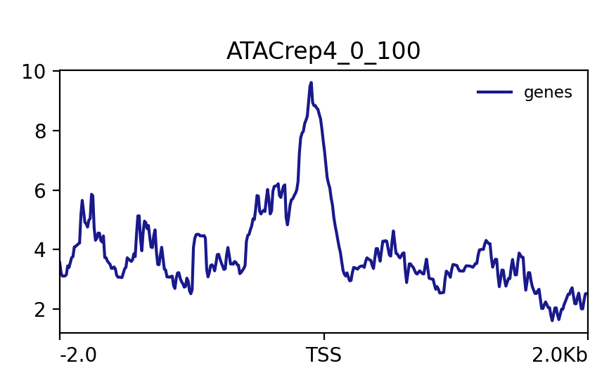
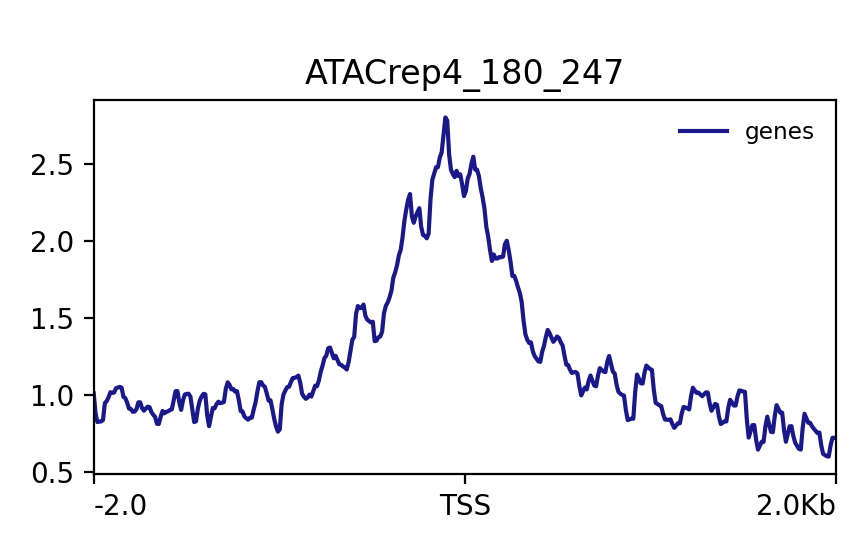
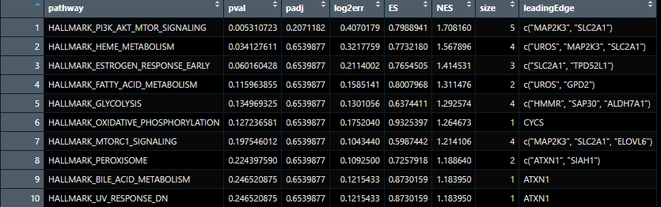
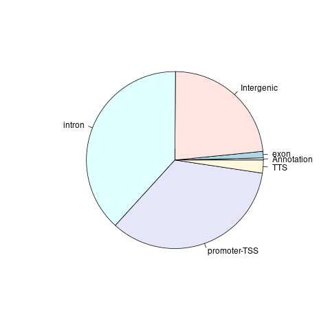

 # ATACSeq

## Methods

Fastq files of two ATAC-seq samples were downloaded. Quality control were performed on these samples by using 
fastqc version 0.12.1-0, and then the reads were trimmed using trimmomatic version 0.39. Human genome hg38 were downloaded 
off of Gencode website and an index was built off of it using bowtie2 version 2.5.3. 

Trimmed reads were aligned to the human genome index with a maximum fragment length of 2000 using bowtie2 align. These aligned reads were converted to BAM files, sorted, indexed, and any alignments to the mitochondrial chromosome were removed using samtools version 1.19.2. Using bedtools ver 2.31.1, the BAM files were converted to bed format and shifted to account for tagmentation using alignmentSieve from deeptools ver 3.5.4.
QC was performed on these bed files using ATACseqQC in R.

Peaks will be called on the bed files with default parameters using MACS v3.0.1. Reproducible peaks were obtained with peaks that had 50% of the peaks in common using bedtools intersect. Peaks that lie in blacklisted areas of the genome will be filtered out using bedtools intersect with the blacklisted genome. Filtered peaks were annotated using the Gencode v45 primary peaks_repr_filtered_annotations. Motifs were found using Homer's findMotifsGenome.pl, with default parameters except for a size of 200.

IP sample matrices were then computed with the hg38 genes using the computeMatrix command on deeptools with 2000 basepairs 
before the TSS and 2000 bp after the TTS, with all other parameters as default. These matrices were plotted using the plotProfile command 
on deeptools. 

Fragment length distribution plot was created for each sample using samtools view.

## Questions to Address
I didn't find too many concerning quality control aspects. From the multiQC we were able to deduce that the Nextera adapter needed to be removed, but after that it seemed that the reads were of good quality. The flagstat files showed that there was no problem with the quality control, and that the mitochondrial reads were removed. I think that its possible that something went wrong with signal coverage plots, since I don't think that the peaks were meant to align, but I couldn't find anything wrong with my code. It's possible that there was something wrong with the quality of the alignment. However, it seems that from the ATACseqQC analysis, the samples were of good quality, so I would not exclude any samples from further analysis.

For ATACrep3, there were 169,214,168 alignments with about 44,697,316 alignments against the mitochondrial chromosome.
For ATACrep4, there were 49,268,808 alignments with about 12,058,171 alignments against the mitochrondial chromosome.

There were 49152 peaks in the ATACrep3 sample, and 42398 peaks in the ATACrep4 sample. There were 282 reproducible peaks, which were found by looking at what peaks had a 50% overlap in both samples. After filtering out blacklisted regions, there 258 peaks left.

The GSEA shows that most relevant pathways to what we are trying to infer is related to motor signaling, metabolism, and estrogen response. I have very little idea what these things have in common, but I would assume that these peaks all have something to do with hormones or are related to the brain in some way. The pie chart shows that most of the peaks where chromatin is accessible is in intron, intergenic, and promoter-TSS regions. This is very surprising to me, since I would have expected there to be more chromatin free regions in the exons compared to the introns, but I suppose thinking about many exons are regulated, and there are more introns then exons, so it makes sense.

Chromatin accessibility can help us understand the epigenetic regulation of the genome, and what kind of envrionmental factors affect what kind of genetic regulation. Knowing what environmental factors affect, for example, cancer, can help us mitigate these and improve public health in general.

## Deliverables
Produce a fragment length distribution plot for each of the samples

Produce a table of how many alignments for each sample before and after filtering alignments falling on the mitochondrial chromosome

Create a signal coverage plot centered on the TSS (plotProfile) for the nucleosome-free regions (NFR) and the nucleosome-bound regions (NBR)
You may consider fragments (<100bp) to be those from the NFR and the rest as the NBR.

A table containing the number of peaks called in each replicate, and the number of reproducible peaks

A single BED file containing the reproducible peaks you determined from the experiment.

This is ATAC_intersect.bed in results folder

Perform motif finding on your reproducible peaks
Create a single table / figure with the most interesting results

Perform a gene enrichment analysis on the annotated peaks using a well-validated gene enrichment tool
Create a single table / figure with the most interesting results

Produce a figure that displays the proportions of regions that appear to have accessible chromatin called as a peak (Promoter, Intergenic, Intron, Exon, TTS, etc.)

